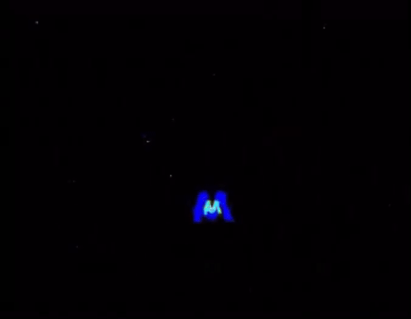
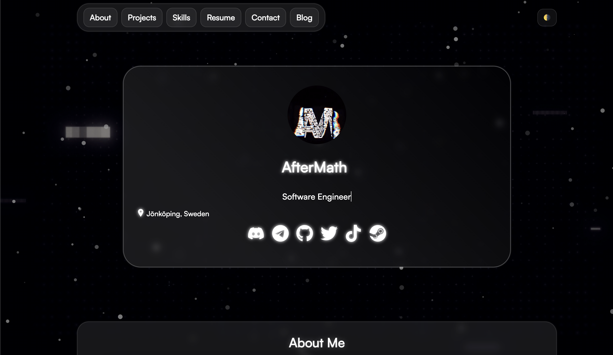

# 🌐 iamr.dev — Personal Portfolio

<p align="center">
  
</p>

<p align="center">
  <b>Modern portfolio<a href="https://github.com/AfterMath9"></a></b><br>
  <sub>Built with ❤️ using HTML, CSS & JavaScript</sub>
</p>

<p align="center">
  <a href="https://github.com/AfterMath9/iamr.dev/stargazers"></a>
  <a href="https://github.com/AfterMath9/iamr.dev/network/members"></a>
  <a href="https://github.com/AfterMath9/iamr.dev/issues"></a>
  <a href="https://github.com/AfterMath9/iamr.dev/blob/main/LICENSE"></a>
</p>

---

## 📸 Preview

<p align="center">
  
</p>

<p align="center">
  <i>✨ Live demo with glowing effects, animated background & social integrations ✨</i>
</p>

👉 **Live Site:** [aftermath9.github.io/iamr.dev](https://aftermath9.github.io/iamr.dev)

---

## ✨ Features
- 🎨 Glassmorphism UI with glowing & animated effects  
- 🎥 Background video + particle effects  
- 🎵 Live **Spotify** & **Discord** status integration  
- 📱 Responsive design (desktop + mobile)  
- 🔗 Direct links to GitHub, LinkedIn, Twitter, Telegram, TikTok, Steam, and more  

---

## 📂 Project Structure

.
├── index.html              # Main landing page
├── style.css               # Global styles
├── static/assets/css/      # Component styles
├── static/userinfo/        # JS for integrations/effects
├── media/                  # Avatars, video, audio
└── README.md               # Project documentation

---

## 🚀 Getting Started

### 1️⃣ Clone the repository
```bash
git clone https://github.com/AfterMath9/iamr.dev
cd iamr.dev

2️⃣ Open locally in browser

open index.html   # Mac
xdg-open index.html   # Linux
start index.html  # Windows

3️⃣ Run with Live Server (optional, hot reload)

# If you don’t have live-server installed globally:
npm install -g live-server

# Start server in the project folder
live-server

4️⃣ Deploy to GitHub Pages

# Make sure you are on main branch
git checkout main

# Add and commit changes
git add -A
git commit -m "Update website"

# Push to GitHub
git push origin main

Then go to GitHub → Settings → Pages and set:
	•	Branch: main
	•	Folder: / (root)

Your site will be live at:
👉 https://aftermath9.github.io/iamr.dev

⸻

🤝 Contributing

# 1. Fork the repo on GitHub
# 2. Clone your fork
git clone https://github.com/<your-username>/iamr.dev
cd iamr.dev

# 3. Create a new branch
git checkout -b feature-name

# 4. Make changes and commit
git add -A
git commit -m "Add new feature"

# 5. Push your branch
git push origin feature-name

Then open a Pull Request on GitHub.

⸻

📜 License

This project is released under the MIT License.
You are free to use, modify, and share — attribution is appreciated!

⸻


<p align="center">
  Developed with ❤️ by <a href="https://github.com/AfterMath9">Aftermath9</a>
</p>
```
